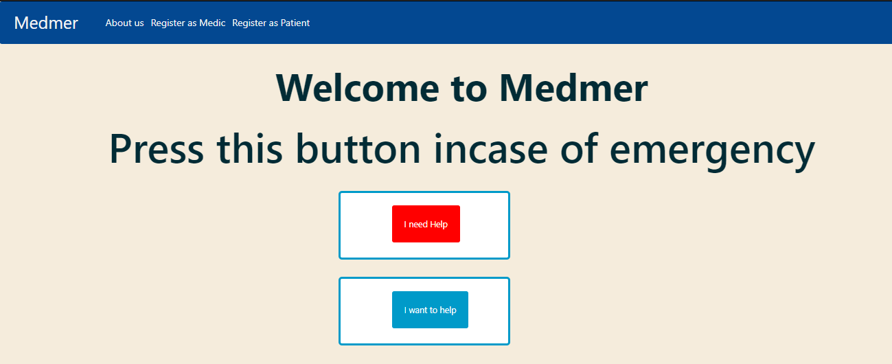

# MedMer - API

The first few minutes of a medical emergency can be the most decisive to recovery of a patient. A rapid and appropriate medical attention can save lives in these unfortunate situations.

A software to connect people in health emergency situations at home to the nearest available medic in the network. 
Medical practitioners are registered to the network. 
People who might dispense help in case of emergency (anyone else) can register to the network as “none medical practitioner”. 

#### Functionalities 
* 1
* 2

## Table of Content
- [MedMer - API](#medmer---api)
      - [Functionalities](#functionalities)
  - [Table of Content](#table-of-content)
  - [Environment](#environment)
  - [Installation](#installation)
  - [File Descriptions](#file-descriptions)
  - [Examples of use](#examples-of-use)
  - [Registration page](#registration-page)
  - [Bugs](#bugs)
  - [Authors](#authors)
  - [License](#license)

## Environment
This project is interpreted/tested on Ubuntu 20.04.2 LTS using python3 (version 3.8.5)

## Installation
* Clone this repository: `git clone https://github.com/Emmastro/medmer-api.git`
* Access the project directory: `cd medmer-api`
* Create a Python Virtual Environment: `python3 -m venv env`
* Activate the virtual environment: `source env/bin/activate`
* Install dependencies: `pip install -r requirements.txt`
* Setup environment variables: make a copy of `.env.sample` and name it `.env`, and setup the values for your environment variables
* Prep database models for migration: `python manage.py makemigrations`
* Migrate database models: `python manage.py migrate`
* Run server: `python manage.py runserver`

## File Descriptions
 
## Examples of use
Below are some of the pictorial features that are on the front end

The above is a view of the home page, with the red and blue buttons for asking and responding to help respectively.

## Registration page
*  Patient registration
  First time patients are registered in the page that is displayed below

## Bugs

## Authors
Emmanuel Murairi - [Github](https://github.com/Emmastro) / [Linkedin](https://www.linkedin.com/in/emmanuel-murairi/)  
Faith Atieno - [Github](https://github.com/Faith-qa ) / [Linkedin](https://www.linkedin.com/in/faith-atieno-209431b6/)  
Peter Lugalia - [Github](https://github.com/Peter5793 ) / [Linkedin](https://www.linkedin.com/in/peter-lugalia-566817123/)  

## License
